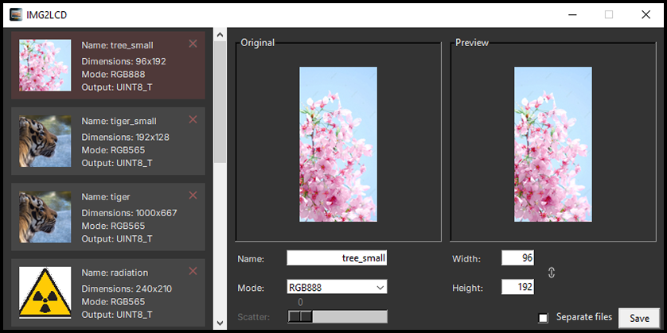

# Image to C Byte Array Converter
A Python application for converting images into **C byte arrays**, with flexible configuration and multiple output formats.

## Features
- Import and edit multiple images at once
- Change the resolution of output images
- Split output data into separate files
- Support for different pixel formats

## Supported Input Formats
- **JPG**
- **PNG**

## Supported Output Pixel Formats
- **1-bit (monochrome)**
- **RGB111**
- **RGB232**
- **RGB565**
- **RGB888**

## Usage
**1. Create a virtual environment:** 
`python -m venv env`

**2. Activate the virtual environment:** 
`env\Scripts\activate`

**3. Install dependencies:** 
`pip install -r requirements.txt`

**4. Run the application:** 
`python main.py`
